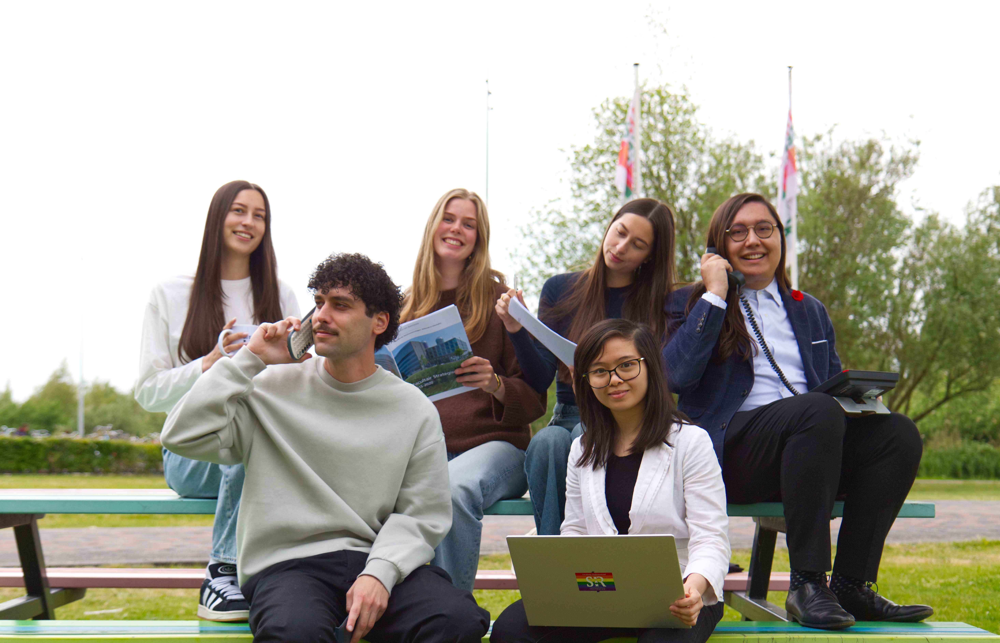
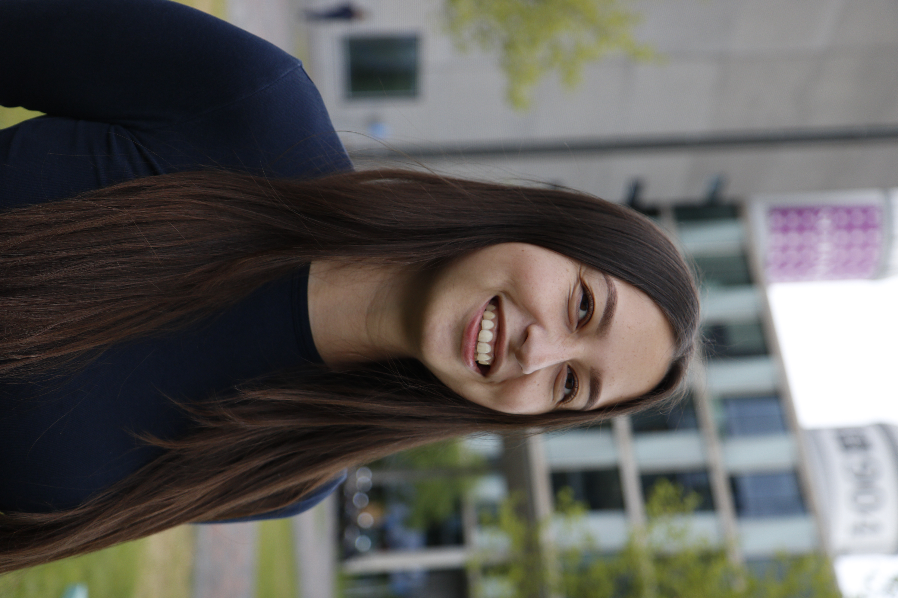
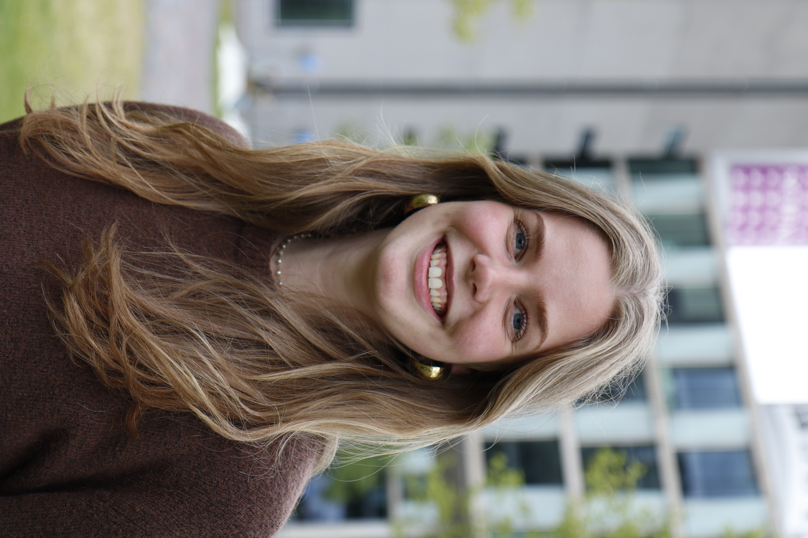
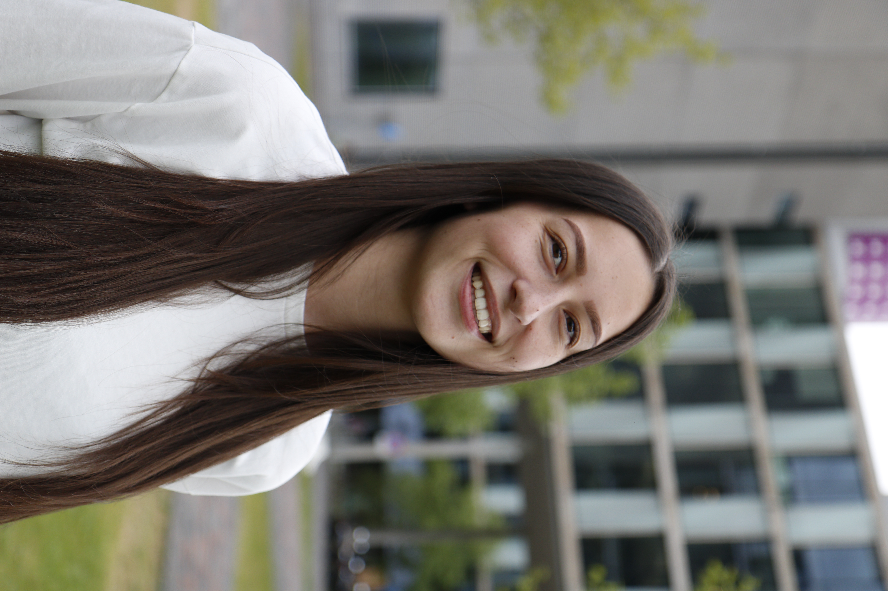
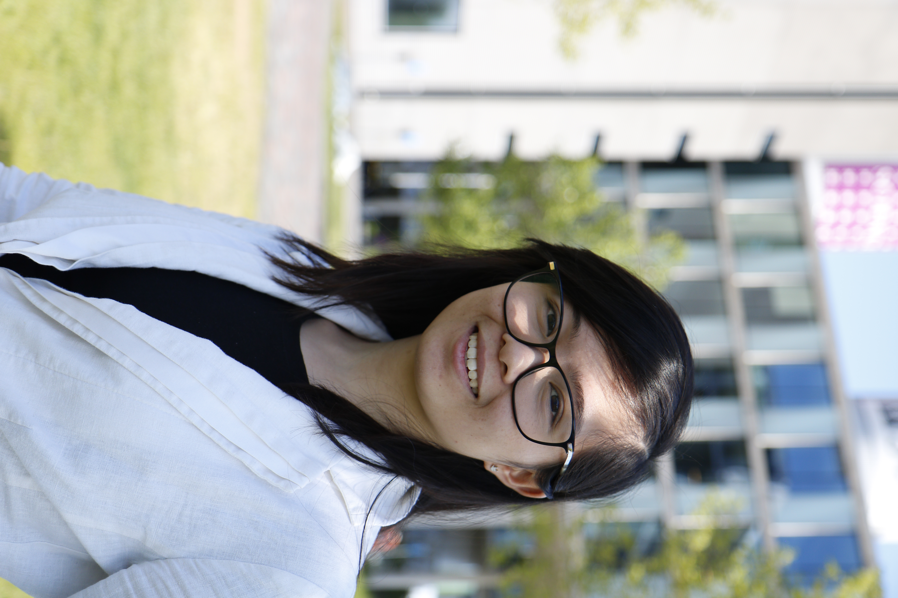
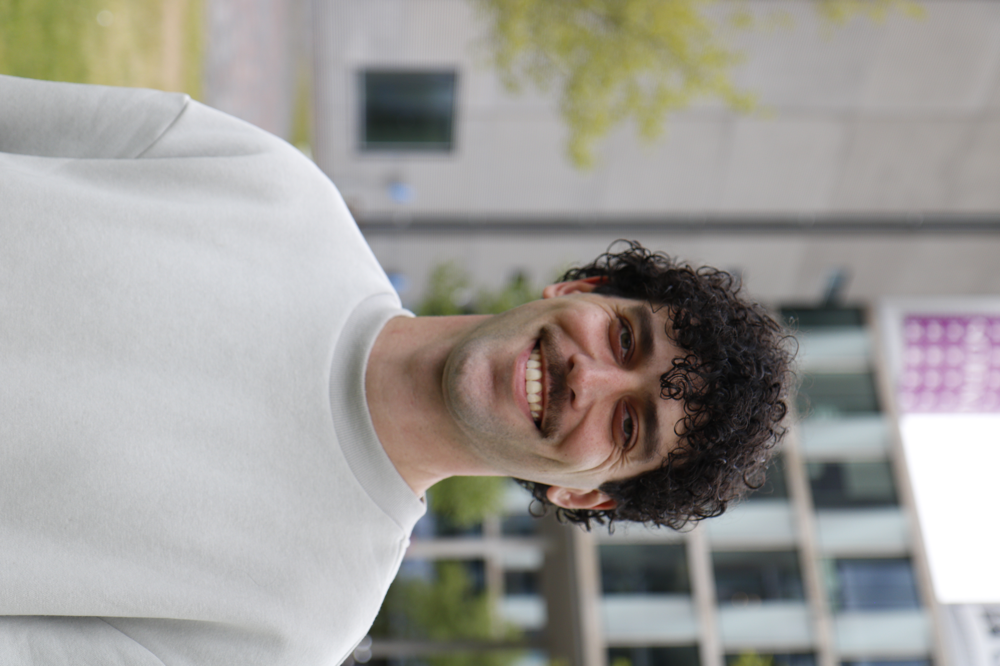
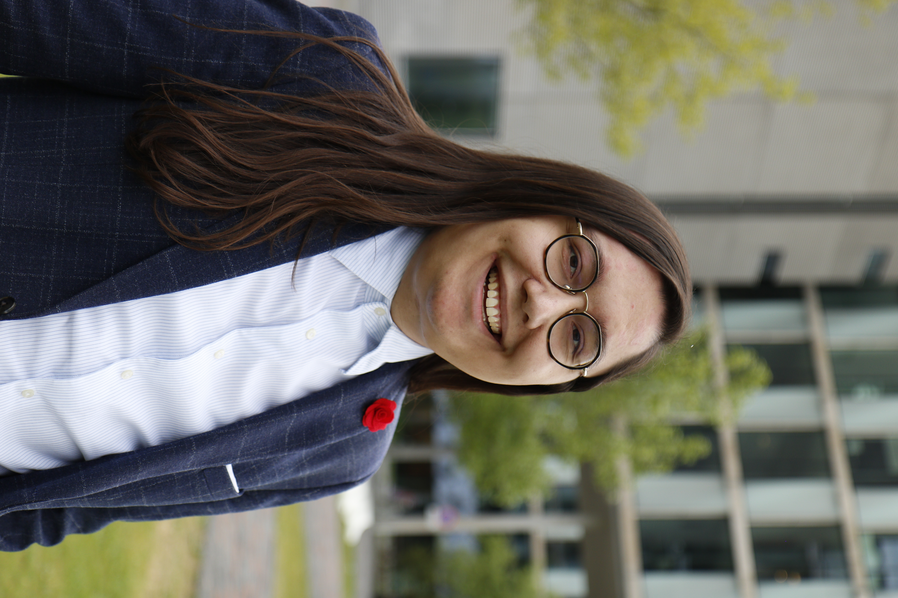

# Verkiezingen 2026

*(For the english version of this page, visit: [http://liefvoorjou.nl/vote](/vote))*

Van 11 tot en met 19 mei 2026 vinden de [studentenraadsverkiezingen van de UvA](https://student.uva.nl/onderwerpen/studentenraadsverkiezingen) plaats. Op deze pagina vind je alle informatie over de lijst en de plannen van LIEF voor aankomend collegejaar. **Met deze link ga je direct naar het digitale stembureau: [stem.liefvoorjou.nl](http://stem.liefvoorjou.nl)**.

## Onze plannen
Hier leggen we uit waar we komend jaar aan willen werken.

  
<h3>Onderwijskwaliteit</h3>In de eerste plaats komen wij hier om te leren. Onderwijskwaliteit moet dus op peil zijn en blijven. Hiervoor is goede evaluatie van het onderwijs cruciaal en studenten hebben hierbij ook recht op terugkoppeling. Naast vaste vakken moet er voor studenten ook ruimte zijn zich met extracurriculaire vakken en activiteiten verder te ontplooien.

  
<h3>Aandacht voor studentenwelzijn</h3>Studeren kan zwaar zijn. Als het wat minder gaat, moet ondersteuning binnen handbereik zijn. Daarom moeten studentenpsychologen en -decanen ook op Science Park beschikbaar zijn. Zeker bij studievertraging heeft de universiteit een ondersteunende rol. Wij willen ook meer aandacht voor sociale veiligheid.

  
<h3>Goede voorzieningen</h3>Om goed te kunnen studeren op Science Park moeten ook de faciliteiten goed geregeld zijn. Wij zien graag voldoende studieplekken, goed ingerichte onderwijsruimtes en een betaalbare kantine.

  
<h3>Sterke medezeggenschap</h3>Studenten moeten geïnformeerd worden over en inspraak hebben op belangrijke facultaire beslissingen.

<!-- Wil je meer lezen over onze plannen? Lees dan ons [assets/doc/LIEFProgramma2026.pdf](ons programma)! -->

## Onze mensen
Voor volgend collegejaar hebben we de volgende kandidaten klaarstaan:


  
<h3>1. Vivienne</h3>Mijn naam is Vivienne en ik studeer inmiddels al 4 jaar op Science Park. Gedurende deze periode heb ik gemerkt dat kleine dingen een groot verschil kunnen maken in je dagelijkse ervaring als student: een goede studieplek, een betaalbare maaltijd tussen de colleges door, het wel of niet hebben van een aanwezigheidsplicht, of de mogelijkheid om een college terug te kijken. Tegelijkertijd zijn er ook grotere thema’s die iedere student raken, zoals de kwaliteit en toegankelijkheid van het onderwijs. Daarom wil ik mij aankomend jaar binnen de studentenraad inzetten voor beleid dat daadwerkelijk aansluit bij de behoeften van studenten. 

  
<h3>2. Evie</h3>Heeyy! Mijn naam is Evie de Wijs. Inmiddels loop ik al vier jaar rond op Science Park, maar pas het afgelopen jaar ben ik bekend geraakt met de Studentenraad. Hoe lang is de nakijktermijn eigenlijk? Wat zijn de regels rondom het gebruik van AI? En wanneer komen er eindelijk goedkopere broodjes in de kantine? Dit zijn vragen waar de Studentenraad antwoorden op heeft of zich actief voor inzet, terwijl veel studenten zich daar niet van bewust zijn. 
Dit jaar wil ik me inzetten voor meer zichtbaarheid van de Studentenraad, zodat we samen een groter draagvlak creëren voor de belangen van studenten. Op die manier kunnen we werken aan vernieuwend onderwijs, betere faciliteiten en meer mogelijkheden voor iedere student!

  
<h3>3. Amanda</h3>Mijn naam is Amanda Jansen en ik studeer inmiddels 4 jaar op Science Park. Tijdens mijn studie heb ik gemerkt dat de universiteit veel meer is dan alleen het volgen van vakken. Juist de ruimte om jezelf breder te ontwikkelen maakt studeren waardevol. Tegelijkertijd zie ik dat dit niet altijd vanzelfsprekend is en soms onder druk staat door rendementsdenken of beperkende regels. Daarom wil ik mij komend jaar binnen de studentenraad inzetten voor beleid dat studenten niet beperkt, maar juist uitnodigt om meer te zijn dan hun cijferlijst. Concreet zal ik mij onder andere inzetten voor meer ruimte voor stages en onderzoeksprojecten binnen het curriculum en betere ondersteuning vanuit de universiteit voor studenten die extra vakken volgen of een dubbele studie doen.

  
<h3>4. Elissa</h3>Hoi hoi! Ik ben Elissa en ben op dit moment ook lid van de facultaire studentenraad als secretaris. Gedurende het jaar is mij duidelijk geworden dat er nog veel te doen is in het onderwijs op onze faculteit. Omdat ik onderwijs voor iedereen ontzettend belangrijk vind, wil ik mij in het komende academisch jaar focussen op het voortzetten van mijn huidige dossier, namelijk de vakevaluaties.

  
<h3>5. Jeroen</h3>Hallo! Mijn naam is Jeroen en ik studeer inmiddels al een aantal jaar op Science Park, vaak met veel plezier. Tijdens deze jaren is het mij ook duidelijk geworden dat er genoeg ruimte is voor verbeteringen in het aangeboden studiemateriaal en de voorzieningen voor studenten op Science Park en de digitale omgevingen. Daarom wil ik mij het komende academische jaar inzetten om deze aspecten voor alle FNWI studies te verbeteren, zodat iedere student het beste uit hun tijd op Science Park kan halen.

  
<h3>6. Robin</h3>Hoi, ik ben Robin, 26 jaar oud en student bij de bachelor informatica. Ik heb inmiddels al bijna 4 jaar---met een pauze tussendoor---in de studentenraad achter de rug en het lijkt me leuk om komend jaar ook weer aan de slag te gaan voor de belangen van studenten. Zelf houd ik mij vooral bezig met zaken die te maken hebben met onderwijs. Denk daarbij bijvoorbeeld aan toegankelijkheid van lessen, de evaluatie van onderwijs en de ondersteuning van vakassistenten. Ook zet ik mij graag in voor de versterking van de medezeggenschap, door bijvoorbeeld nauw in contact te staan met opleidingscommissies, om zo te kijken of zij problemen ervaren die breder spelen, of om ze in staat te stellen informatie en kennis uit te wisselen.


